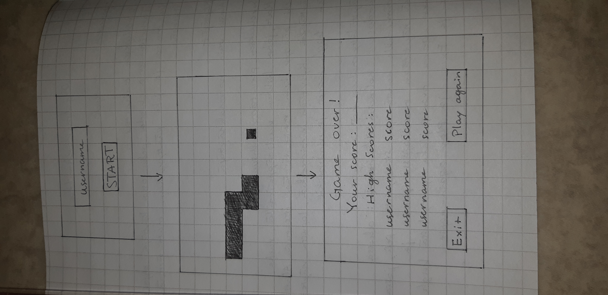

## Sovelluksen tarkoitus
Tarkoituksena luoda matopeli, jossa käyttäjä ohjaa nuolinäppäimillä matoa siten, että se ei törmää seiniin. 
Samalla näytölle ilmestyy ruokapaloja joita syömällä madon pituus kasvaa. Peli päättyy silloin kun mato törmää johonkin. 
Pelin lopuksi näytetään käyttäjän kerryttämät pisteet ja tallennetaan ne tiedostoon.

## Käyttäjät
Peli ei vaadi sisäänkirjautumista, mutta kysyy alussa käyttäjältä nimimerkkiä. Jos käyttäjä on pelannut peliä samalla 
nimimerkillä aikaisemmin, se on tallentunut tiedostoon ja pelaajan pisteitä ainoastaan päivitetään. 

## Käyttöliittymä
Sovelluksessa on kolme eri näkymää: alussa on tekstikenttä, johon syötetään nimimerkki ja Start-nappi. Toisessa näkymässä on 
itse peli. Kolmannessa näkymässä on teksti "Game over", käyttäjän keräämä pistemäärä ja kaksi nappia: Exit ja Play again.

## Perusversion tarjoama toiminnallisuus
- käyttäjä voi syöttää nimimerkin, kirjautumista ei tarvita. On myös mahdollista pelata nimettömänä, jolloin pisteet eivät tallennu
tiedostoon
- painamalla Play-nappia peli alkaa
- käyttäjä ohjaa matoa nuolinäppäimillä
- mato syö ruokaa, jolloin käyttäjä saa pisteen, ja mato kasvaa
- peli päättyy kun mato törmää seinään
- kun mato on törmännyt, vasempaan yläkulmaan ilmestyy STOP-nappi, jota painamalla pääsee kolmanteen näkymään
- kun peli päättyy siirrytään Game over-näkymään, jossa nähdään käyttäjän sillä pelikerralla kerryttämät pisteet, sekä jossa on 
Play again- ja Exit-napit 
- Play again-napista peli siirtyy suoraan toiseen näkymään, eli käyttäjä pelaa automaattisesti samalla nimimerkillä
- exit-nappi siirtää pelin ensimmäiseen näkymään, jossa on mahdollista vaihtaa nimimerkkiä
- pelin päätyttyä tarkistetaan, onko nimimerkki jo olemassa tiedostossa. Mikäli sitä ei ole tiedostossa, se kirjataan sinne
ja annetaan pisteet, jotka käyttäjä on ansainnut ensimmäisellä pelikierroksellaan
- jos nimimerkki on jo olemassa, verrataan vanhoja pisteitä uusiin pisteisiin ja tehdään muutos, jos käyttäjän uudet pisteet ovat 
paremmat kuin tiedostoon tallennetut pisteet
- jos käyttäjä ei ole antanut käyttäjänimeä, mitään ei tallenneta 

Jatkokehitysideoita
- eri tasoja (seinät, mato liikkuu nopeammin)
- kirjautuminen
- alussa käyttäjä voi katsoa high score-listaa
- pelissä pisteet näytetään reaaliaikaisesti
- animaation hidastus
- pelinäkymän vaihtaminen automaattisesti kun animaatio on pysähtynyt
