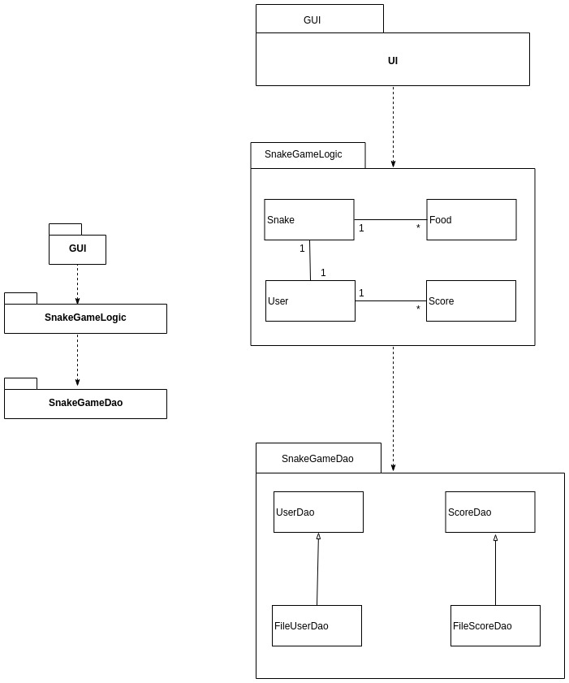
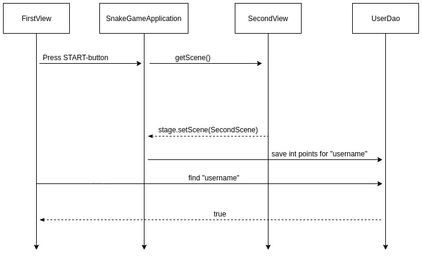
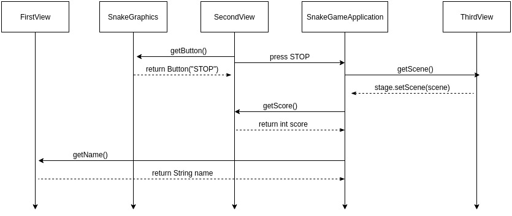
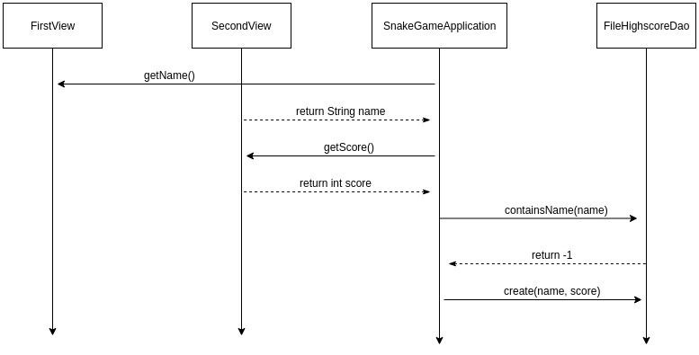

# Rakenne:

 

# Käyttöliittymä

Käyttöliittymä sisältää kolme erilaista näkymää: 
- nimimerkin syöttäminen
- pelinäkymä
- loppunäkymä

Jokainen näkymä on oma luokkansa, jossa on metodi, joka palauttaa Scene-olion. 
Lisäksi ohjelmassa on erillinen luokka [SnakeGameApplication](https://github.com/AnnaKuokkanen/SnakeGame/blob/master/SnakeGame/src/main/java/gui/SnakeGameApplication.java), 
joka näkee nämä kolme luokkaa ja vastaa 
eri näkymien vaihtamisesta. Sama luokka myös kutsuu metodeja luokasa 
[FileHighscoreDao](https://github.com/AnnaKuokkanen/SnakeGame/blob/master/SnakeGame/src/main/java/snakegamedao/FileHighscoreDao.java), 
jota käytetään tietojen pysyväistallennukseen. 

# Sovelluslogiikka

Sovelluslogiikan muodostavat luokat [Snake](https://github.com/AnnaKuokkanen/SnakeGame/blob/master/SnakeGame/src/main/java/snakegamelogic/Snake.java), 
[Food](https://github.com/AnnaKuokkanen/SnakeGame/blob/master/SnakeGame/src/main/java/snakegamelogic/Food.java) ja 
[Score](https://github.com/AnnaKuokkanen/SnakeGame/blob/master/SnakeGame/src/main/java/snakegamelogic/Score.java).
Nämä luokat vastaavat kirjanpidosta ja niitä käytetään käyttöliittymän luokissa 
olioina. 

# Tietojen pysyväistallennus

Pakkauksen snakegamedao DAO-suunnittelumallia noudattava luokka FileHighscoreDao 
sisältää metodeja tiedostoon tallentamista varten. SnakeGameApplication kutsuu 
sen metodeja pelin lopussa, jolloin se tallentaa nimimerkit ja pisteet highscore.txt-nimiseen tiedostoon. 

### Tiedosto

Jos ohjelman suorituksen alussa projektin juuressa ei ole tiedostoa highscore.txt, 
ohjelma luo sellaisen. Kun käyttäjän peli on päättynyt, tiedostoon tallennetaan 
käyttäjänimi ja käyttäjän kerryttämät pisteet muodossa 
`käyttäjänimi:pisteet`

Käyttäjänimi toimii id:nä. Jos samalla käyttäjänimellä on jo pelattu, uutta riviä 
ei luoda, vaan pisteet päivitetään sillä ehdolla, että uudet pisteet ovat paremmat
kuin vanhat pisteet. 

## Päätoiminnallisuudet
 
### Pelin aloittaminen

Sekvenssikaavio esittää pelin alkua ja pisteiden tallennusta. Peli alkaa kun käyttäjä syöttää kenttään nimimerkin ja painaa START-nappia. Tämä vaihtaa näkymän pelinäkymään ja tallentaa käyttäjänimen tietokantaan, jos se ei ole vielä tietokannassa. 
Kun pelaaja on hävinnyt pelin, tietokantaan tallennetaan hänen pisteensä. 

### Pelin lopettaminen

Sekvenssikaavio esittää sitä, kuinka SnakeGameApplication vaihtaa näkymiä ja 
hakee käyttäjän nimen ja pisteet.

### Uuden käyttäjän luominen

Tässä esitetään, kuinka ohjelma toimii, jos käyttäjänimi on uusi.

### Käyttäjän pisteiden päivittäminen 

## Ohjelman rakenteeseen jääneet heikkoudet

### Käyttöliittymä 

Käyttöliittymässä animaatiota toteuttavaa metodia kutsutaan toisesta luokasta,
mikä aiheuttaa sen, että näkymää ei saada vaihdettua automaattisesti, kun animaatio 
on pysähtynyt, vaan tarvitaan nappi. Lisäksi animaatio vaikuttaa ensimmäisellä 
pelikerralla alkavan jo nimen syöttämisen aikana, joten jos nimen syöttäminen
kestää liian pitkään, peli saataa olla jo päättynyt, kun seuraavaan näkymään päästään.
Tämä ratkeaa painamalla Play again. 
