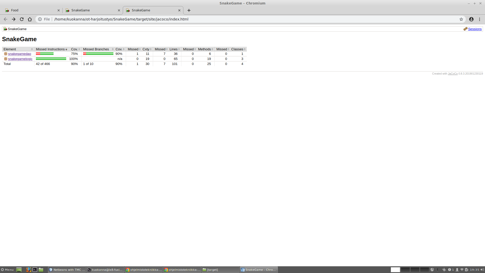

# Testausdokumentti 

Ohjelmaa on testattu manuaalisesti ja JUnit-testeillä.

## Yksikkö- ja integraatiotestaus

### Sovelluslogiikka

Sovelluslogiikaa testaavat kolme testiluokaa:
[SnakeTest](https://github.com/AnnaKuokkanen/SnakeGame/blob/master/SnakeGame/src/test/java/snakegamelogictest/SnakeTest.java), 
[FoodTest](https://github.com/AnnaKuokkanen/SnakeGame/blob/master/SnakeGame/src/test/java/snakegamelogictest/FoodTest.java) ja 
[ScoreTest](https://github.com/AnnaKuokkanen/SnakeGame/blob/master/SnakeGame/src/test/java/snakegamelogictest/ScoreTest.java)

Kaikki logiikaa testaavat testit ovat yksikkötestejä.

### DAO-luokat

FileHighscoreDao-luokkaa on testattu luomalla JUnitin TemporaryFolder-olio ja siihen tiedosto.

### Testikattavuus

Käyttöliittymä on jätetty pois testauksesta. Tällä hetkellä kokonaisrivikattavuus 90%.
DAO-luokan testeissä joitakin puutteita.

## Järjestelmätestaus

Järjestelmätestaus on tässä ohjelmassa suoritettu manuaalisesti.

## Sovellukseen jääneet laatuongelmat

